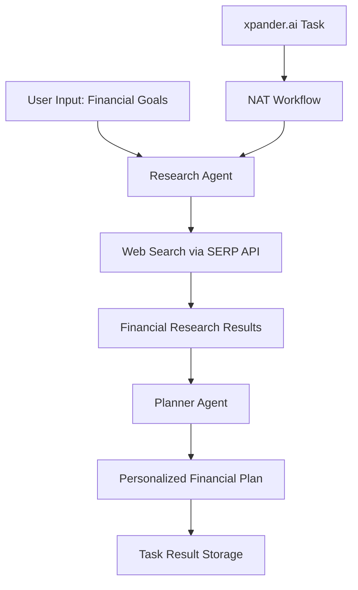

# Agno Personal Finance Agent with xpander.ai

This project is an enhanced version of NVIDIA's [NeMo-Agent-Toolkit Personal Finance example](https://github.com/NVIDIA/NeMo-Agent-Toolkit/tree/develop/examples/frameworks/agno_personal_finance), integrated with [xpander.ai](https://xpander.ai) for agent orchestration and task management.

**Based on**: NVIDIA NeMo Agent Toolkit's Agno Personal Finance workflow
**Enhanced with**: xpander.ai SDK for enterprise agent orchestration

## What is this?

This is a **personal financial planning agent** that generates tailored financial plans using AI. It combines:
- **Research Agent**: Searches the web for financial advice, investment opportunities, and savings strategies
- **Planner Agent**: Creates personalized financial plans based on research and user preferences
- **xpander.ai Integration**: Enterprise-grade task management and execution tracking

## 🚀 Quick Start with xpander.ai

**Prerequisites**: You need a free [xpander.ai account](https://app.xpander.ai) to use this agent.

### Step 1: Set up xpander.ai

```bash
# Install xpander CLI
npm install -g xpander-cli

# Login to xpander.ai
xpander login
```

### Step 2: Create your Financial Planning Agent

#### Option A: Using xpander CLI

```bash
# Create a new agent with Agno + NeMo framework
xpander agent new
# When prompted:
# - Choose framework: "agno" 
# - Choose integration: "nemo" (for NVIDIA NeMo Assistant Toolkit)
# - Agent name: "financial-planner" (or your preferred name)
```

#### Option B: Using xpander.ai Web Interface

1. Go to [app.xpander.ai](https://app.xpander.ai)
2. Click **"Create New Agent"** 
3. Select **Agent Framework**:
   - Choose **"Agno + Nvidia NeMo"** (lightning-fast, model-agnostic framework)
4. Configure Agent Settings:
   - **Name**: `financial-planner` (or your preferred name)
   - **Description**: `Personal Financial Planning Agent with AI Research`
   - **System Instructions**: 
     ```
     You are a professional financial planning assistant that helps users create personalized financial plans. You combine web research with expert financial planning knowledge to provide comprehensive, actionable advice on budgeting, investing, saving, and achieving financial goals.
     ```
5. Add Required Tools:
   - **Web Search Tool** (SERP API) - for financial research
   - Configure with your SERP API key
6. Click **"Create Agent"**

> 💡 **Note**: The web interface provides a more visual setup experience and automatically configures some defaults for you.

### Step 3: Set up the Financial Agent Code

```bash
# Navigate to your agent directory
cd financial-planner  # or whatever you named your agent

# Copy the financial planning files from this example
cp -r /path/to/framework-examples/nemo-agno-personal-finance-agent/* .

# Install dependencies
python -m venv .venv
source .venv/bin/activate
make install
```

### Step 4: Configure API Keys

```bash
# Copy environment template
cp .env.example .env

# Edit .env with your credentials (see Configuration section below)
```

### Step 5: Test and Deploy

```bash
# Run the event listener and test using the xpander platform
xpander dev

# Deploy to xpander.ai cloud
xpander deploy

# Test your agent
xpander agent invoke "financial-planner" "I'm 30 years old, earn $75k, want to retire by 55. Help me create a financial plan."
```

✅ **Your financial planning agent is now live and accessible via xpander.ai dashboard, Slack, or API!**

## Key Features

### 🧠 Dual-Agent Architecture
- **Financial Researcher**: Searches for relevant financial information using SERP API
- **Financial Planner**: Creates personalized plans based on research findings

### 🔧 Technology Stack
- **[Agno Framework](https://github.com/agno-agi/agno)**: Lightning-fast, model-agnostic multimodal agent library
- **NVIDIA NeMo Assistant Toolkit**: Enterprise LLM gateway and workflow management
- **xpander.ai SDK**: Agent orchestration, task management, and execution tracking
- **SERP API**: Real-time web search capabilities for financial research

### 🏢 Enterprise Features
- Multi-tenant organization support
- Secure credential management
- Task lifecycle management with persistence
- Async execution for high performance
- Container-ready deployment
- Error handling with automatic retries

## How It Works

The agent follows a two-stage workflow:



### Stage 1: Research
The **Researcher Agent**:
1. Analyzes your financial goals and situation
2. Generates relevant search terms
3. Searches the web using SERP API
4. Returns the 10 most relevant financial insights

### Stage 2: Planning  
The **Planner Agent**:
1. Combines your input with research results
2. Creates a structured financial plan
3. Includes budgets, investment strategies, and savings goals
4. Provides actionable recommendations with proper attribution

## Execution Modes

### 1. Direct Invocation (Development & Testing)
```bash
nat run --config_file nemo_config.yml --input "I'm 30, earn $80k, want to retire by 55"
```

### 2. Event Listener (Production)
```bash
xpander dev
```
Automatically processes xpander.ai tasks as they arrive.

## Prerequisites & Setup

### Required Accounts & API Keys

1. **[xpander.ai Account](https://app.xpander.ai)** - Free account required for agent hosting
2. **OpenAI API Key** - For GPT models ([get here](https://platform.openai.com/api-keys))
   - Alternative: Anthropic API Key for Claude models
3. **SERP API Key** - For web search functionality ([sign up here](https://serpapi.com/users/sign_up))
4. **Python 3.11+** - For local development

### Getting Your xpander.ai Credentials

After creating your xpander.ai account:

1. **API Key**: Go to [xpander.ai Settings](https://app.xpander.ai) → Settings → API Keys
2. **Organization ID**: Found in your organization settings
3. **Agent ID**: Created when you run `xpander agent new`

> 💡 **First time with xpander.ai?** Start with the [Quick Start guide](#-quick-start-with-xpanderai) above!

## Manual Installation (Alternative)

> ⚠️ **Recommended**: Use the [Quick Start with xpander.ai](#-quick-start-with-xpanderai) above for the easiest setup.

If you prefer to set up manually:

### 1. Clone and Setup Environment

```bash
# Clone this repository
git clone https://github.com/xpander-ai/xpander.ai.git
cd xpander.ai/framework-examples/nemo-agno-personal-finance-agent

# Create virtual environment
python -m venv .venv
source .venv/bin/activate  # On Windows: .venv\Scripts\activate

# Install dependencies with automatic conflict resolution
make install
```

> 💡 The `make install` command automatically resolves the agno version conflict between `nvidia-nat-agno` (requires agno~=1.2.3) and the required `agno>=1.8.2`.

### 2. Configure Environment Variables

```bash
cp .env.example .env
```

Edit `.env` with your credentials:

```env
# xpander.ai Configuration (get from https://app.xpander.ai)
XPANDER_API_KEY="your_xpander_api_key"
XPANDER_ORGANIZATION_ID="your_org_id" 
XPANDER_AGENT_ID="your_agent_id"

# LLM API (choose one)
OPENAI_API_KEY="your_openai_key"
# ANTHROPIC_API_KEY="your_anthropic_key"

# SERP API for web search (required)
SERP_API_KEY="your_serp_api_key"
```

### 3. Test the Installation

```bash
# Test the financial planning workflow locally
nat run --config_file nemo_config.yml --input "I'm 35, software engineer earning $90k annually. I want to retire by 60 with enough savings to maintain my current lifestyle."
```

Expected output: A comprehensive financial plan with budgeting advice, investment strategies, and actionable steps.

## Usage

### 🌐 Using via xpander.ai Platform (Recommended)

Once deployed, you can interact with your financial planning agent through multiple channels:

#### 1. Web Dashboard
Go to [app.xpander.ai](https://app.xpander.ai) → Your Agent → Chat interface

#### 2. Slack Integration
Add your agent to Slack workspaces for team financial planning discussions

#### 3. API Calls
```bash
# Direct API invocation
curl -X POST https://api.xpander.ai/v1/agents/invoke \
  -H "Authorization: Bearer $XPANDER_API_KEY" \
  -H "Content-Type: application/json" \
  -d '{
    "agent_id": "your_agent_id",
    "message": "I'm 28, make $75k, have $10k saved. Help me plan for buying a house in 3 years."
  }'
```

#### 4. xpander CLI
```bash
# Quick agent testing
xpander agent invoke "financial-planner" "I'm 45, annual income $120k, want to retire at 62. Current 401k balance is $250k."
```

### 🛠️ Local Development Mode

For testing and development before deployment:

```bash
# Run locally with NeMo Assistant Toolkit
nat run --config_file nemo_config.yml --input "I have $50k to invest. I'm 30 years old and have moderate risk tolerance."

# Run the xpander event handler locally
python xpander_handler.py
# Then test via xpander.ai dashboard or CLI
```

### Example Output

```
### Personalized Financial Plan for Early Retirement at Age 60

#### Current Situation
- Age: 40 years old  
- Occupation: Machine Learning Engineer at NVIDIA
- Goal: Retire at age 60
- Time Horizon: 20 years

#### Budget Recommendations
- Housing: 25-30% of income
- Savings/Investments: 20-30% of income  
- Emergency fund: 6 months expenses

#### Investment Strategy
- Maximize 401(k) contributions with employer matching
- Diversified portfolio with tech sector focus
- Consider index funds for long-term growth
- Explore real estate investment opportunities

[... detailed plan continues ...]
```

### 🚀 Production Deployment

#### Option 1: xpander.ai Cloud (Recommended)

```bash
# Deploy to xpander.ai managed infrastructure
xpander deploy

# View deployment status
xpander status

# Stream logs
xpander logs
```

Benefits:
- ✅ Managed infrastructure and scaling
- ✅ Built-in monitoring and alerting  
- ✅ Multi-channel access (Web, Slack, API)
- ✅ Automatic failover and recovery
- ✅ Usage analytics and metrics

#### Option 2: Self-Hosted with Docker

```bash
# Build the image
docker build -t financial-planner-agent .

# Run with event listener
docker run -d --name financial-planner \
  --env-file .env \
  financial-planner-agent

# Check logs
docker logs financial-planner -f
```

#### Option 3: Local Event Handler

```bash
# Run the xpander event handler locally
python xpander_handler.py
```

This mode automatically processes tasks from xpander.ai platform while running on your infrastructure.

## Configuration

### NeMo Configuration example (`nemo_config.yml`)

```yaml
general:
  use_uvloop: true
  telemetry:
    logging:
      console:
        _type: console
        level: CRITICAL

functions:
  web_search_tool:
    _type: serp_api_tool
    api_key: ${SERP_API_KEY}

llms:
  openai:
    _type: openai
    model_name: gpt-4.1
    temperature: 0

workflow:
  _type: xpander_nemo_agent
  llm_name: openai
  tools: [web_search_tool]  # Essential for financial research
  verbose: false
  retry_parsing_errors: true
  max_retries: 3
```

## Features

### Financial Planning Capabilities
- 💰 **Personalized Financial Plans**: Tailored budgets, investment strategies, and savings goals
- 🔍 **Real-time Research**: Web search integration for current financial data and trends
- 📈 **Investment Analysis**: Market research and investment opportunity identification
- 💡 **Actionable Recommendations**: Specific steps with proper source attribution
- 🎯 **Goal-oriented Planning**: Retirement, home buying, debt payoff, wealth building
- ⚡ **Dual-agent Architecture**: Specialized research and planning agents

### Technical Features
- 🤖 **Agno Framework Integration**: Lightning-fast, model-agnostic agent execution
- 🔧 **SERP API Integration**: Real-time web search for financial information
- 📊 **Execution Metrics**: Token usage, tool utilization, and performance tracking
- 🔄 **xpander.ai Integration**: Enterprise task management and persistence
- 🛡️ **Error Handling**: Automatic retries and robust error recovery
- 🐳 **Production Ready**: Docker deployment with API endpoints

## Development

### Project Structure

```
agno-finance-agent/
├── xpander_nemo_agent.py    # Main financial agent implementation
│                           # - Dual-agent workflow (researcher + planner)
│                           # - xpander.ai SDK integration
│                           # - SERP API web search integration
├── xpander_handler.py       # Production event listener
│                           # - Processes xpander.ai tasks
│                           # - Spawns NAT workflows
├── nemo_config.yml          # NeMo configuration
│                           # - LLM settings (OpenAI/Anthropic)
│                           # - SERP API tool configuration
│                           # - Workflow parameters
├── pyproject.toml           # Dependencies and build config
├── Dockerfile               # Production container
├── Makefile                 # Automated installation
└── .env.example             # API keys template
```

### Architecture Deep Dive

```python
# Core workflow in xpander_nemo_agent.py

# 1. Load NeMo LLM and tools
llm = await builder.get_llm(config.llm_name, wrapper_type=LLMFrameworkEnum.AGNO)
tools = builder.get_tools(tool_names=config.tools, wrapper_type=LLMFrameworkEnum.AGNO)

# 2. Create specialized agents
researcher = Agent(
    role="Financial researcher",
    model=llm,
    tools=tools,  # SERP API for web search
    instructions=["Generate search terms", "Search web", "Return top 10 results"]
)

planner = Agent(
    role="Financial planner", 
    model=llm,
    instructions=["Create personalized plan", "Include budgets & strategies"]
)

# 3. Execute workflow
research_results = await researcher.arun(user_input)
financial_plan = await planner.arun(f"User: {user_input}\nResearch: {research_results}")
```

### Key Components

1. **`xpander_nemo_agent.py`**: Financial planning workflow that:
   - Implements dual-agent architecture (researcher + planner)
   - Integrates SERP API for real-time financial research  
   - Uses Agno framework for high-performance agent execution
   - Handles xpander.ai task management and result persistence
   - Provides execution metrics (tokens, tools, timing)

2. **`xpander_handler.py`**: Production service that:
   - Listens for xpander.ai task events via webhook/polling
   - Spawns NAT processes for each financial planning request
   - Manages concurrent task execution and scaling
   - Handles task lifecycle and error recovery

### Original vs Enhanced Version

| Feature | NVIDIA Original | This Enhanced Version |
|---------|----------------|----------------------|
| **Core Functionality** | Dual-agent financial planning | ✅ Same + xpander.ai integration |
| **Task Management** | Single execution only | ✅ Enterprise task orchestration |
| **Deployment** | Manual CLI invocation | ✅ Event-driven production service |
| **Persistence** | No result storage | ✅ Automatic task result persistence |
| **Scaling** | Single instance | ✅ Horizontal scaling support |
| **Monitoring** | Basic logging | ✅ Execution metrics + telemetry |
| **API Integration** | Direct CLI only | ✅ REST API + webhook support |

### Testing Your Financial Agent

#### 1. Quick CLI Test

```bash
# Test via xpander CLI (after deployment)
xpander agent invoke "financial-planner" "I'm 25, just graduated, starting salary $60k. Help me create a financial plan for the next 10 years including emergency fund, debt payoff, and retirement savings."
```

#### 2. Local NeMo Testing (Development)

```bash
# Test the financial planning workflow locally
nat run --config_file nemo_config.yml --input "I'm 50, household income $150k, need to plan for kids' college and my retirement in 15 years."
```

#### 3. xpander.ai Dashboard Testing

1. Go to [app.xpander.ai](https://app.xpander.ai)
2. Navigate to your agent
3. Use the built-in chat interface to test scenarios
4. View execution logs and metrics in real-time

#### 4. Production Event Handler Testing

```bash
# Run the event handler locally
python xpander_handler.py

# In another terminal, create a task
xpander agent invoke "financial-planner" "Test message"
```

### Sample Financial Planning Scenarios

1. **Young Professional**: "I'm 22, first job at $50k, living with roommates, want to move out and start investing"
2. **Mid-Career**: "I'm 35, married, $100k combined income, want to buy a house and plan for kids"
3. **Pre-Retirement**: "I'm 55, want to retire in 10 years, have $500k in 401k, need to optimize my strategy"
4. **Career Change**: "I'm 40, switching careers, took a 20% pay cut, need to adjust my financial plan"
5. **Debt Management**: "I have $50k in student loans, $10k credit card debt, make $80k, need a payoff strategy"

### Debugging

Enable verbose logging by modifying `nemo_config.yml`:

```yaml
general:
  telemetry:
    logging:
      console:
        level: DEBUG  # Change from CRITICAL
workflow:
  verbose: true  # Enable verbose mode
```

## Troubleshooting

### Common Issues

1. **"No web search results found"**
   - Check SERP_API_KEY is set correctly in `.env`
   - Verify SERP API account has sufficient credits
   - Test SERP API key: `curl "https://serpapi.com/search.json?q=test&api_key=YOUR_KEY"`

2. **"Agent execution failed"**
   - Ensure all required API keys are set (OPENAI_API_KEY, XPANDER_API_KEY, SERP_API_KEY)
   - Check API key permissions and quotas
   - Verify internet connectivity for web searches

3. **"NAT command not found"**
   - Run `make install` to ensure proper installation
   - Activate virtual environment: `source .venv/bin/activate`
   - Check installation: `pip list | grep nvidia-nat`

4. **"Task timeout or poor quality responses"**
   - Increase `max_retries` in `nemo_config.yml`
   - Adjust `temperature` for more/less creative responses
   - Check LLM model availability and quotas

### Performance Optimization

- Use `use_uvloop: true` for better async performance
- Adjust `temperature` and `max_retries` based on use case
- Consider using faster models for development/testing

## Contributing

When contributing to this project:

1. Follow the existing code structure and patterns
2. Update tests for new functionality
3. Ensure Docker builds successfully
4. Update documentation for new features

## Real-World Use Cases

### Individual Financial Planning
- **Recent Graduates**: Student loan management, first apartment, emergency fund building
- **Young Professionals**: Investment portfolio creation, home buying preparation, retirement planning
- **Mid-Career**: Family financial planning, college savings, insurance optimization
- **Pre-Retirees**: Retirement withdrawal strategies, Medicare planning, estate planning

### Financial Advisors & Professionals
- **Initial Client Assessments**: Automated plan generation for new clients
- **Scenario Analysis**: Quick "what-if" planning for different life events
- **Research Automation**: Current market data gathering for client presentations
- **Plan Updates**: Refreshing existing plans with latest market information

## Comparison with Original NVIDIA Example

This enhanced version builds upon NVIDIA's excellent foundation:

**✅ Retained from Original**:
- Dual-agent architecture (researcher + planner)
- Agno framework integration for high performance
- SERP API web search capabilities
- Comprehensive financial planning logic
- Docker deployment support

**🚀 Enhanced Features**:
- **xpander.ai Integration**: Enterprise task orchestration and management
- **Production Service**: Event-driven architecture for real-world deployment
- **Task Persistence**: Automatic result storage and retrieval
- **Scaling Support**: Handle multiple concurrent financial planning requests
- **Advanced Error Handling**: Robust retry logic and error recovery
- **Metrics & Monitoring**: Detailed execution tracking and telemetry

## Support & Resources

**Documentation & Support**:
- xpander.ai SDK: [docs.xpander.ai](https://docs.xpander.ai)
- NVIDIA NeMo: [NeMo toolkit documentation](https://docs.nvidia.com/nemo-framework/)
- Agno Framework: [github.com/agno-agi/agno](https://github.com/agno-agi/agno)
- Original NVIDIA Example: [NeMo-Agent-Toolkit](https://github.com/NVIDIA/NeMo-Agent-Toolkit/tree/develop/examples/frameworks/agno_personal_finance)

**API Documentation**:
- SERP API: [serpapi.com/search-api](https://serpapi.com/search-api)
- OpenAI API: [platform.openai.com/docs](https://platform.openai.com/docs)
- Anthropic API: [docs.anthropic.com](https://docs.anthropic.com)

---

*This project demonstrates the power of combining specialized AI frameworks (Agno + NeMo) with enterprise orchestration (xpander.ai) to create production-ready AI agents that solve real-world problems.*
