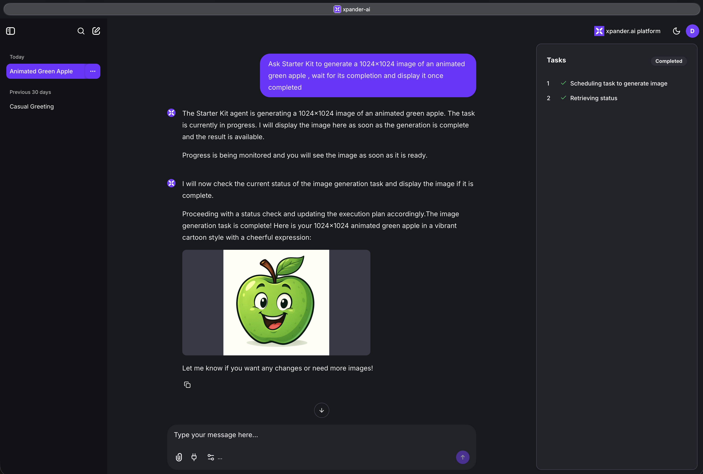

<h3 align="center">
  <a name="readme-top"></a>
  <picture>
    <source media="(prefers-color-scheme: dark)" srcset="images/Purple%20Logo%20White%20text.png">
    
  </picture>
</h3>

<div align="center">
  <h3>
    <font size="7">⚡️ Build, run, and ship agents — any framework, anywhere</font>
  </h3>
  <p>
    💬 Chat • 🧪 Workbench • 🏗️ AgentOS • 🗄️ DB • 🚦 CI/CD • 🔐 Self-Hosted • 🧑‍💻 Full code access
  </p>
</div>

<div align="center">
  <a href="https://pepy.tech/projects/xpander-sdk"></a>
  <a href="https://github.com/xpander-ai/xpander.ai/blob/main/LICENSE"></a>
  <a href="https://pypi.org/project/xpander-sdk"></a>
  <a href="https://npmjs.com/package/xpander-sdk"></a>
  <a href="https://app.xpander.ai"></a>
</div>

---

<div align="center">
  <a href="https://chat.xpander.ai">Chat</a>
  • <a href="https://docs.xpander.ai">Docs</a>
  • <a href="https://docs.xpander.ai/Examples">Examples</a>
  • <a href="https://xpander.ai">Website</a>
</div>

---

xpander.ai is the runtime and control plane to build, run, and ship reliable AI agents fast. Start in Chat to use your agents immediately. Deploy Managed Agents (serverless) or Embedded Agents (containers). Add tools in Workbench. Run in xpander cloud or your own VPC/Kubernetes. Every agent gets a stateful DB, CI/CD, and logs — with full code access. Works with any framework.

## 🧰 The xpander.ai Platform (at a glance)

💬 Chat (chat.xpander.ai) — Generalist AI agent that auto‑discovers your agents and can schedule tasks. It’s the front door for everyone to use your agents and tools (supports your own domain and self‑hosting).

🧪 Workbench (app.xpander.ai) — Your control plane for any agent framework. Start with the Starter Kit template, then add tools from the menu: MCP servers, connectors, built‑in actions, or custom actions.

🏗️ AgentOS — Deploy agents of any framework on a production runtime in your VPC/Kubernetes or in xpander cloud; includes a reliable task scheduler and orchestration for long‑running jobs, plus stateful DB, logs, secrets, observability, and CI/CD.

🔌 Connector Hub — Generate and run MCP servers from OpenAPI specs or use the built‑in library of 2,000+ tools. Supports OAuth and API keys, and integrates natively with Claude, ChatGPT, and other MCP clients.

🛠️ AI Tools — OCR, browser automation, code interpreter, serverless code runner, PDF/CSV utilities, and more.

## 🚀 Getting Started

Sign up and log in at https://app.xpander.ai

Your account includes a preconfigured "Starter Kit" agent with a few tools and stateful storage to preserve sessions and showcase what’s possible. In Workbench, you can customize the system prompt, switch the model, or download the full agent code to modify and deploy.

Workbench screenshot


Then open Chat at https://chat.xpander.ai → pick the "Starter Kit" agent, add MCP tools, or ask it to run tasks.

This unified Chat is a rich generalist agent that can schedule tasks across all your deployed agents. Anything you add in Workbench shows up here automatically.

Example:


## 🛳️ Build More Agents & Ship to Production

🛠️ Managed Agents (serverless, ~2 min)

- app.xpander.ai → New Agent → Starter Kit (or pick a framework)
- Add tools from the menu: MCP servers, connectors, built‑in actions, or custom actions
- Click Deploy → you get a stateful DB, logs, and CI/CD out of the box

<p align="center" width="100%">
<video src="https://github.com/user-attachments/assets/649c5b24-a90e-4dae-9860-c2cf2a5333f6"
       width="80%" controls>
</video>
</p>

🔧 Embedded Agents (container, ~3 min)

```bash
npm install -g xpander-cli && xpander login
mkdir hello-world && cd hello-world
xpander agent new --name "hello-world" --framework agno --folder .
python3 -m venv .venv && source .venv/bin/activate && pip install -r requirements.txt
xpander dev   # local run
xpander deploy && xpander logs
```

Switch anytime

- Start Managed. Convert to Embedded by downloading code and redeploying:

```bash
xpander agent init <agent-id>
xpander agent deploy
```

Where it runs

- xpander cloud or your VPC/Kubernetes (AgentOS) — for both Managed and Embedded

Managed vs Embedded (quick compare)

- Managed: serverless, no infrastructure, auto‑scales; fastest path for internal tools and quick production
- Embedded: your container and dependencies; full framework/runtime control; ideal for advanced policies, private packages, and GPUs

You can also build new MCP servers with xpander.ai — build once, use everywhere

- Generate from OpenAPI or bring your own
- Host in xpander cloud or your VPC/Kubernetes
- Use from agents and any MCP client (e.g., Claude Desktop)

🧩 Works with any framework: Agno, LangChain, PydanticAI, CrewAI — or your own runtime.

## 🔗 How to Use Your Agents

All agents—Managed or Embedded—are instantly available via Chat, Webhook, REST API, SDK, A2A, and MCP.

1) 💬 Chat — `chat.<yourdomain>` (or https://chat.xpander.ai)

2) 🌐 Webhook — per‑agent HTTPS endpoint

```bash
curl --location "https://webhook.xpander.ai?agent_id=$XPANDER_AGENT_ID" \
  --header 'X-api-key: $XPANDER_API_KEY' \
  --header 'Content-Type: application/json' \
  --data '{"prompt":"Summarize Q3 pipeline risks"}'
```

3) 🔌 REST API — unified HTTP access to all agents (Agno, LangChain, PydanticAI, CrewAI, custom frameworks)

Universal control plane at `https://api.xpander.ai` — one API for any framework, any language.

```bash
curl --location "https://api.xpander.ai/v1/tasks/invoke" \
  --header 'x-api-key: $XPANDER_API_KEY' \
  --header 'Content-Type: application/json' \
  --data '{"agent_id":"$XPANDER_AGENT_ID","prompt":"Summarize Q3 pipeline risks"}'
```

Manage agents, invoke tasks (sync/async/streaming), handle knowledge bases, and access toolkits — all through standard HTTP.

Full API documentation: https://docs.xpander.ai/api-reference/rest-api

4) 🧪 SDK

```bash
pip install "xpander-sdk[agno]"
```

```env
# .env
XPANDER_API_KEY=your_xpander_api_key
XPANDER_ORGANIZATION_ID=your_org_id
XPANDER_AGENT_ID=your_agent_id
```

```python
from xpander_sdk import Backend
from agno.agent import Agent

backend = Backend()  # reads XPANDER_* from .env
agent = Agent(**backend.get_args())  # DB, MCP tools, system prompt

agent.print_response("What can you help me with?")
```

5) 🤝 A2A — agent‑to‑agent calls from Chat or the SDK. Schedule tasks across agents with one command.

6) 🧩 MCP — connect all your agents to Claude Desktop, Cursor, and any MCP client

Use your xpander agents directly in your IDE via the Model Context Protocol:

```json
{
  "mcpServers": {
    "xpander.ai": {
      "command": "npx",
      "args": [
        "-y",
        "mcp-remote@latest",
        "https://api.xpander.ai/mcp/",
        "--header",
        "x-api-key:YOUR_API_KEY"
      ]
    }
  }
}
```

**Available MCP Tools:**
- List agents — discover all agents in your organization
- Invoke agent — execute any agent task
- Create task — queue tasks for agents
- Get task — retrieve task status and results
- Get agent threads — access conversation history
- Get thread messages — retrieve specific thread messages

**MCP Endpoints:**
- Standard: `https://api.xpander.ai/mcp/`
- Server-Sent Events (SSE): `https://api.xpander.ai/mcp/sse`

Plus: governed connectors and MCP servers (2,000+ tools) hosted in xpander cloud or your VPC/Kubernetes.

## 🧑‍💻 Customize the Agent Code (optional)

Containerized agents include real code you control. A handler listens for tasks from the control plane and provides a `Task` object so you can choose the framework, tools, and runtime behavior. Not needed for serverless or no‑code agents.

Simply run `xpander agent new` and follow the wizard. It creates an `xpander_handler.py` file and a `Dockerfile`.

Here’s an example of `xpander_handler.py` already configured with Agno.

```python
from xpander_sdk import Task, on_task, Backend
from agno.agent import Agent

@on_task
async def handler(task: Task):
    backend = Backend(configuration=task.configuration)
    agent = Agent(**backend.get_args(task=task))
    return await agent.arun(message=task.to_message())
```

## 📚 Examples

- Local template: `02-agents/local-agent/` — run the agent locally and use Ollama for a private LLM
- DevOps agent: `02-agents/devops/` — run the agent in the cloud with EKS permissions to troubleshoot logs
- Travel agent: `02-agents/travel-agent/` — a simple agent that helps with travel
- Data agent: `02-agents/data-agent/` — demo of building your own front‑end (instead of the xpander.ai Chat UI) with Streamlit

# Docs & Community

- Documentation: https://docs.xpander.ai
- API Reference: https://docs.xpander.ai/api-reference/07-sdk
- Join our Slack: https://xpander.ai/slack-community

# License

- Open‑source SDK runtime: Apache 2.0
- Hosted platform: Commercial (free tier available)

<p align="right">
  <a href="#readme-top">↑ Back to Top ↑</a>
</p>
